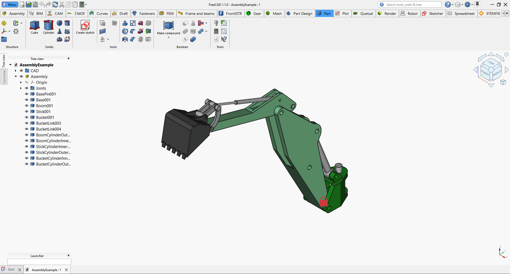
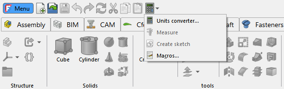
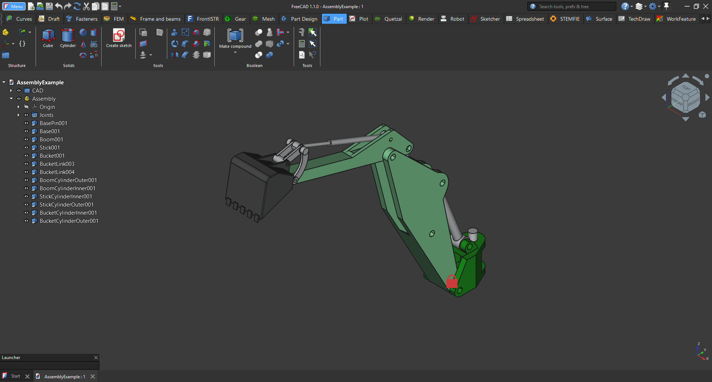

## FreeCAD Ribbon UI

An Ribbon UI for FreeCAD, based on the PyQtRibbon library (https://github.com/haiiliin/pyqtribbon).
This ribbon is based the work of Geolta (https://github.com/geolta/FreeCAD-Ribbon) and HakanSeven (https://github.com/HakanSeven12/Modern-UI) for the Modern-UI workbench.








The FreeCAD ribbon provides the following functions and features:

* Replace the default toolbars with a ribbon based on the original toolbars
* The ribbon design is stored in a Json file for easy modification of the ribbon design.
* A Ribbon Design dialog is provided for easy customization. (The changes are stored in the Json file). With this dialog you can:
  * Set the button size to small, medium or large for:
    * For individual buttons
    * For one panel
    * For more panels
    * For all panels in a workbench
    * for all panels in every workbench    
  * Include/exclude toolbars to be used as a panel in the ribbon
  * Include/exclude workbenches
  * Combine panels into your own custom panel
  * Create your own custom panel with any button across workbenches
  * Change the order of the panels
  * Change the order of the buttons
  * Set your own text for the buttons
* You can apply your own stylesheet
* And much more...

See the [wiki page](https://github.com/APEbbers/FreeCAD-Ribbon/wiki) for more details and on how to customize the Ribbon to your preference.
In the [Road map](https://github.com/APEbbers/FreeCAD-Ribbon/wiki/07-%E2%80%90-Road-map) you can see the development plan for the Ribbon.
Please note that the road map is a live document that can change over time.

## Installation

### Install via the Addon Manager

1. Open FreeCAD [Addon Manager](https://wiki.freecad.org/Std_AddonMgr).
1. Search for 'FreeCAD-Ribbon'.
1. Click on 'Install'.

Result: Addon will be installed and FreeCAD will prompt for a restart.
Accept prompt and FreeCAD will restart with the Ribbon addon included.

Note: See [wiki page/installation](https://github.com/APEbbers/FreeCAD-Ribbon/wiki/01-%E2%80%90-Installation) for other ways to install.


## Uninstallation

1. Remove the folder of this in the `Mod` folder of your FreeCAD installation
1. Restart FreeCAD.
1. When you restarted you don't see any toolbar.
1. Create a new macro (Macro menu -> macros...-> create macro)
1. Paste this code in to the new macro.

    ```python
    from PySide import QtCore, QtGui, QtWidgets
    mw = FreeCADGui.getMainWindow()
    mw.menuBar().show()

    WBList = FreeCADGui.listWorkbenches()
    for WB in WBList:
        FreeCADGui.activateWorkbench(WB)
        for tb in mw.findChildren(QtWidgets.QToolBar):
            tb.show()
    ```

1. Execute the macro
1. Restart FreeCAD.

## Discussion

Feel free to discuss this addon on the [FreeCAD Forum](https://forum.freecad.org/viewtopic.php?t=91353).

## Known Issues

- To retrieve all toolbars and command per workbench, all workbenches must be activated. Unfortunally, this results in a longer loading time for the Ribbon Design menu. (up to a few minutes)
* When the Assembly4 Workbench is installed, make sure that the internal assembly workbench is placed before the Assembly4 workbench. If not, the ribbon for the internal assembly will show the wrong panel named "Assembly".

## License

GPL v3.0 (see [LICENSE](LICENSE))
